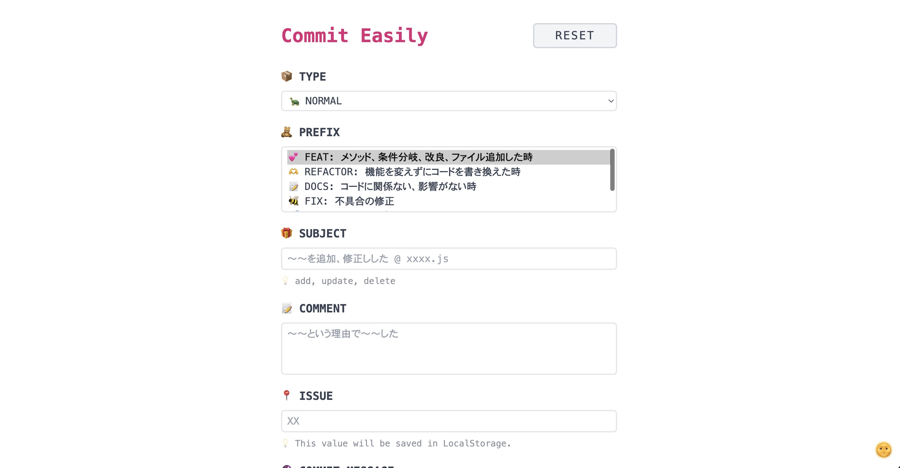

<!--  -->

# Commit Easily

Commit Easily はコミットメッセージを簡単に何も考えずに作成できる Web アプリです。
[Version 3.0.0]から fork して、ご自身に合った prefix を簡単に作成することができます。

## 概要

- prefix の入力を簡単にしたい
- プロジェクトごとの prefix を簡単に取得、閲覧したい
- 何のための prefix かの解説も同時に見たい
- スペースの開け方を統一したい
- ターミナルの入力途中に間違ってエンターキーを押してやりなおしたくない
- とにかく頭を無にして何も考えることなくコミットメッセージを考えたい

そんな人（自分）の悩みを解決する Web アプリです。

URL: https://pss-aileen.github.io/project-github-commit-message/

## 使い方

1. prefix のタイプを選択
1. prefix を選択
1. 変更内容の概要を入力
1. 詳細を書く（必要であれば）
1. issue 番号を書く（必要であれば）
1. GENERATE をクリックしてコミットメッセージを生成
1. COPY をクリックしてターミナルに貼り付け

## 使用技術

- HTML/CSS
- React
- TypeScript
- Tailwind CSS
- その他
  - json に prefix を保管し、オブジェクト指向をでプログラムを書きました（Version 3 から）

## 制作について

- 制作期間（初回リリース）
  - 3 日
- こだわり
  - 気分が上がるように可愛いアイコンを使ってデザインをまとめました

---

## Release

show detail

- **[Version 4.0.0] 2024/09/07**
  - 改修
    - React で全面的に改修
    - git コマンドの生成を廃止 -> GitHub Desktop 用のメッセージ生成に変更
- **[Version 3.0.2] 2024/03/23**
  - 修正
    - NORMAL の PREFIX を変更
- **[Version 3.0.1] 2024/03/10**
  - 修正
    - TYPE PRACTICE PROJECT に WATCH を追加
      - Udemy 講座を視聴して、見た動画ごとにコミットする場合の prefix
- **[Version 3.0.0] 2024/02/24**
  - 内部構造作り替え
    - オブジェクト指向でプログラムを組み直し
    - prefix の情報を json で管理するように変更
- **[Version 2.0.7] 2024/01/30**
  - 修正
    - 選択肢にアイコン追加
    - PAIZA の選択肢の順番変更
- **[Version 2.0.6]**
  - skip
- **[Version 2.0.5] 2024/01/03**
  - 新機能
    - ダークモードに対応
  - 修正
    - RELEASE、NEW の時、SUBJECT を自動的に出力
- **[Version 2.0.4] 2024/01/01**
  - 修正
    - UPDATE の日付を 2411→240101 になるよう変更
- **[Version 2.0.3] 2023/12/23**
  - 修正
    - UPDATE の自動日付を 20231223 から 231223 になるように変更
- **[Version 2.0.2] 2023/12/22**
  - 新機能
    - prefix で UPDATE を選んだ時、日付が自動で SUBJECT に入るようにした
- **[Version 2.0.1] 2023/12/17**
  - 新機能
    - リセットボタン: 自分のインターネット回線が遅くでリロードして書いた内容を消していると面倒だったので、リセットボタンを作成
  - practice-project 用の prefix の追加
- **[Version 2.0.0] 2023/12/13**
  - 新機能
    - プロジェクトごとに prefix を切り替えられる機能を追加
  - 修正
    - prefix が複数選択できる問題を解決（HTML の Select から multiple を削除）
- **[Version 1.0.0] 2023/12/03**

