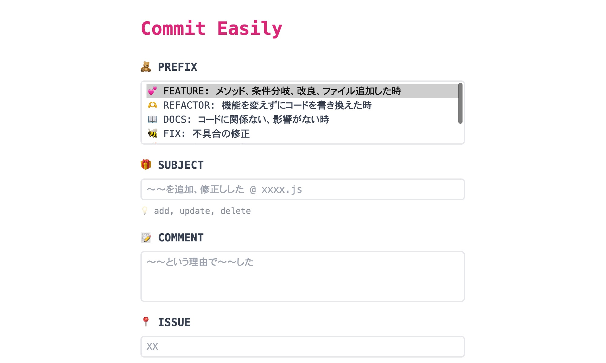

# Commit Easily 
Commit Easilyはコミットメッセージを簡単に何も考えずに作成できるWebアプリです。

[Version 2.0.0]からforkして、ご自身に合ったprefixを簡単に作成することができます。

## 概要
- prefixの入力を簡単にしたい
- プロジェクトごとのprefixを簡単に取得、閲覧したい
- 何のためのprefixかの解説も同時に見たい
- スペースの開け方を統一したい
- ターミナルの入力途中に間違ってエンターキーを押してやりなおしたくない
- とにかく頭を無にして何も考えることなくコミットメッセージを考えたい

そんな人（自分）の悩みを解決するWebアプリです。

URL: https://pss-aileen.github.io/project-github-commit-message/

## 使い方
1. prefixのタイプを選択
1. prefixを選択
1. 変更内容の概要を入力
1. 詳細を書く（必要であれば）
1. issue番号を書く（必要であれば）
1. GENERATEをクリックしてコミットメッセージを生成
1. COPYをクリックしてターミナルに貼り付け

## 使用技術
- HTML/CSS
- JavaScript
- Tailwind CSS

## 制作について
- 制作期間
  - 3日
- こだわり
  - 気分が上がるように可愛いアイコンを使ってデザインをまとめました

---

- [Version 1.0.0] 2023/12/03
- [Version 2.0.0] 2023/12/13
  - 新機能
    - プロジェクトごとにprefixを切り替えられる機能を追加
  - 修正
    - prefixが複数選択できる問題を解決（HTMLのSelectからmultipleを削除）
- [Version 2.0.1] 2023/12/17
  - 新機能
    - リセットボタン
      - 自分のインターネット回線が遅くでリロードして書いた内容を消していると面倒だったので、リセットボタンを作成
    - practice-project用のprefixの追加
- [Version 2.0.2] 2023/12/22
  - 新機能
    - prefixでUPDATEを選んだ時、日付が自動でSUBJECTに入るようにした
- [Version 2.0.3] 2023/12/23
  - 修正
    - UPDATEの自動日付を20231223から231223になるように変更